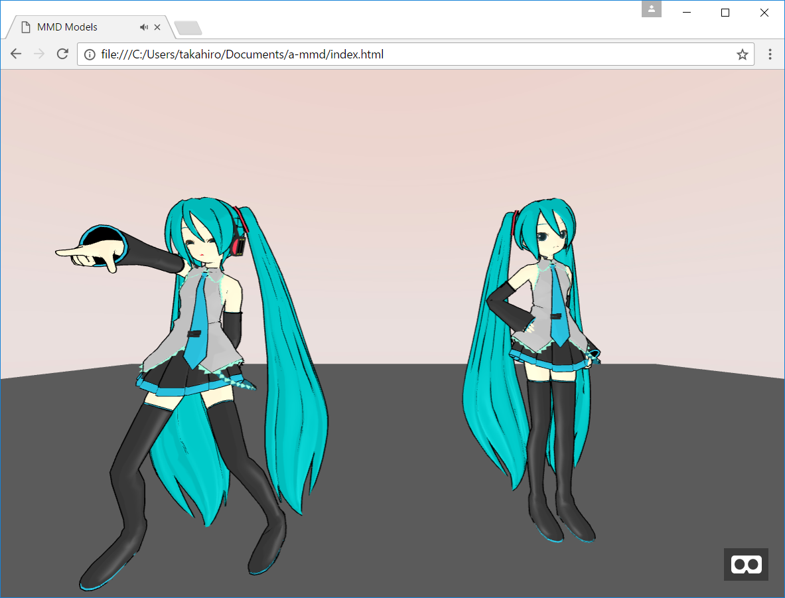
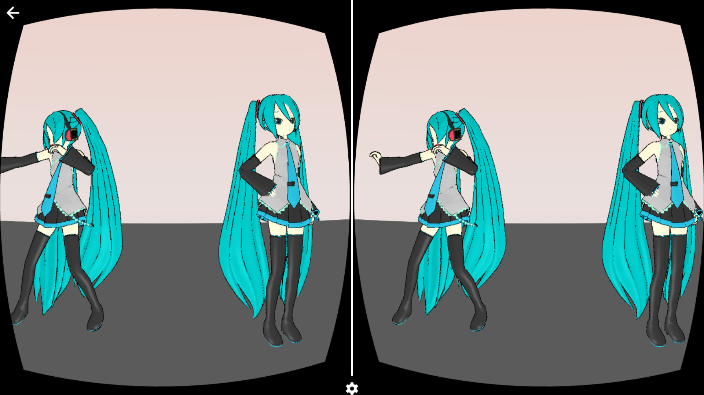

# A-Frame MMD component

a-mmd is an A-Frame MMD component which enables MMD models to dance and sing.




## Demo

[Demo Dance](https://cdn.rawgit.com/takahirox/a-mmd/v1.0.2/index.html)
[Demo Posing](https://cdn.rawgit.com/takahirox/a-mmd/v1.0.2/index2.html)

# Dependencies

## Required A-Frame revision

A-Frame v0.5.0 or newer (Three.js r83 or newer)

## Ammo.js

You need to load ammo.js in a page where a-mmd works

https://github.com/kripken/ammo.js/

## A-Frame Outline effect component

To draw outline, use A-Frame Outline effect component.

https://github.com/takahirox/aframe-outline

## Properties

### mmd

| Properties     | type    | Default Value | Description |
| -------------- | ------- | ------------- | ----------- |
| audio          | string  | ''            | Audio file path. |
| autoplay       | boolean | true          | Automatically start audio and dance when they're ready. |
| volume         | number  | 1.0           | Audio volume. |
| audioDelayTime | number  | 0.0           | How long audio delays to start to play since model starts to dance. |
| afterglow      | number  | 0.0           | How long model keeps the last motion since dance/audio ends. |

### mmd-model

| Properties | type    | Default Value | Description |
| ---------- | ------- | ------------- | ----------- |
| model      | string  | ''            | MMD model file path. |
| vpd        | string  | ''            | MMD pose file path. |
| vmd        | string  | ''            | MMD dance file path. You can set multiple vmd files separated by ',' |
| physics    | boolean | false         | If turn on physics. |
| blink      | boolean | false         | If model blinks one's eyes. |


## Browser

### How to use

```html
<head>
  <script src="https://cdn.rawgit.com/aframevr/aframe/v0.5.0/dist/aframe-master.min.js"></script>
  <script src="https://cdn.rawgit.com/kripken/ammo.js/dcab07bf0e7f2b4b64c01dc45da846344c8f50be/builds/ammo.js"></script>
  <script src="https://cdn.rawgit.com/takahirox/aframe-outline/v1.1.0/build/aframe-outline.min.js"></script>
  <script src="https://cdn.rawgit.com/takahirox/a-mmd/v1.0.2/build/a-mmd.min.js"></script>
</head>

<body>
  <a-scene antialias="true" outline>
    <a-entity position="0 10 20">
      <a-camera></a-camera>
    </a-entity>

    <a-entity mmd="audio:./audios/audio.mp3;">
      <a-entity mmd-model="model:./models/model.pmd;
                           vmd:./vmds/dance.vmd;"></a-entity>
    </a-entity>

    <a-light type="ambient" color="#888"></a-light>
    <a-light color="#AAA" distance="100" intensity="0.4" type="point"></a-light>
  </a-scene>
</body>
```

## NPM

### How to install

```
$ npm install a-mmd
```

### How to build

```
$ npm install
$ npm run all
```

### How to load

```
require('./libs/ammo.js');
require('aframe');
require('a-mmd');
```

## Copyright

You are allowed to use Crypton's Vocaloid(Hatsune Miku, Kagamine Rin, and so on)
stuffs (MMD models, songs, and so on) only if you follow the guideline set by
Crypton Future Media, INC. for the usage of its characters.

For detail, see http://piapro.net/en_for_creators.html


## MMD assets license

The license of MMD assets used in index.html

https://github.com/mrdoob/three.js/tree/dev/examples/models/mmd#readme
